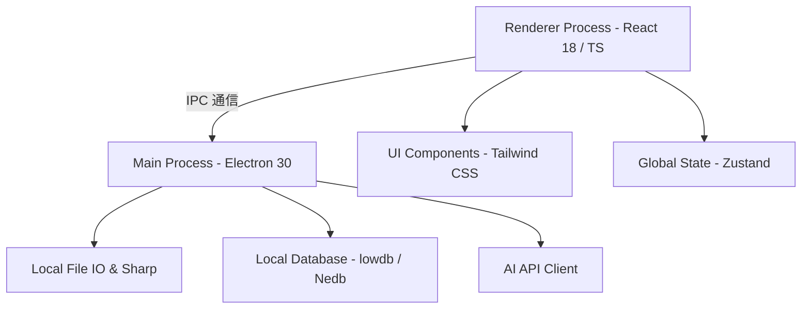

<div align="center">
  
  
  # 小册子 (Booklet)
  
  ### ✦ 专业级本地跨平台素材管理与 AI 灵感整理工具 ✦

  [](https://react.dev/)
  [](https://www.electronjs.org/)
  [](https://vitejs.dev/)
  [](https://www.typescriptlang.org/)
  [](https://tailwindcss.com/)
  [](LICENSE)

  <p align="center">
    面向设计师、原画师及前/后端开发人员的高能本地素材管理系统。<br />
    不仅是一个优雅的<b>“仿 Eagle/Billfish”</b>图库，更是您本地 AI 赋能的创意灵感中心。
  </p>

  <p align="center">
    <a href="#-核心特性">核心特性</a> •
    <a href="#-技术架构">技术架构</a> •
    <a href="#-快速开始">快速开始</a> •
    <a href="#-快捷键操作面板">快捷键指南</a> •
    <a href="#-项目打包">项目打包</a>
  </p>
</div>

---

## 🎨 核心特性

### 🌿 极致无边框美学与手柄交互
* **极简无线条设计**：全面精简了面板交界处的冗余分割线条，完全采用高雅的色块边界（白色主内容区、浅灰侧栏与属性栏）进行层次划分，契合现代审美。
* **绝对定位透明手柄**：彻底移除了传统的物理拖拽条占位，重构为完全透明的绝对定位悬浮热区。平时隐藏，触碰时高亮，保持白色顶栏（Topbar）极致的纯净无痕。
* **层级覆盖优化**：主内容区利用层级机制，保证“布局与排序”等浮动级联下拉菜单完美覆盖在所有边栏之上，彻底消除线段穿透。

### 🤖 本地 AI 智能识别与属性分析
* **AI 批量识别**：集成先进大语言模型接口，可一键对选中素材进行 AI 图像理解，自动生成内容描述，并提取标签。
* **智能色卡提取 (Palette)**：前端 Canvas 聚类算法，自动分析提取任意图片的 **8 个主色调** 及其占比，鼠标悬停即刻显示对应 Hex 色值，点击即可一键复制到剪贴板，彻底解放灵感配色。

### 📁 深度整理与看板联动
* **无限级树状文件夹**：支持鼠标任意拖拽层级、内联重命名（F2）、自定义文件夹颜色与角标，完美收纳千万个素材。
* **自适应画布看板 (Boards)**：支持对特定主题建立看板，自由将多处素材引流汇聚，方便项目全局把控。
* **一键查重 (Duplicate Resolver)**：基于文件大小与分辨率哈希精准秒级比对，轻松揪出硬盘中的重复文件，一键释放存储空间。

### 🔍 精准的多维检索与筛选
* **全局命令搜索面板**：`Ctrl + F` / `Ctrl + P` 随时唤起，快速定位。
* **高阶筛选器 (Filter Bar)**：支持按标签、尺寸、宽高比例、文件格式、星级评分、创建时间进行多重条件联合过滤。
* **精细化文件信息显示**：支持在网格卡片下方灵活开启显示“尺寸/分辨率”和“文件大小”，满足专业用户的整理控要求。

---

## 🛠 技术架构



* **运行容器**：`Electron` — 保证本地文件系统深度读取性能，提供一致的桌面级窗口区域拖拽体验。
* **前端框架**：`React 18` + `TypeScript` + `Vite` — 带来毫秒级的极速模块热更新（HMR）与强健的静态类型检查机制。
* **状态管理**：`Zustand` — 轻量级、无样板代码的跨组件状态流转，实现多边栏状态、选择态的极速同步。
* **CSS 样式**：`Tailwind CSS` — 响应式栅格系统，配合自适应图片等宽/等高瀑布流渲染。

---

## 🚀 快速开始

### 前提条件

确保您的本地开发环境已安装 [Node.js](https://nodejs.org/) (建议 `v18.x` 或更高版本) 以及 `npm`。

### 安装依赖

```bash
# 克隆仓库
$ git clone https://github.com/xiaoche0907/Xcz-work.git
$ cd Xcz-work

# 安装项目所有依赖包
$ npm install
```

### 开发环境启动

```bash
# 启动热重载 Vite 开发服务器及 Electron 主进程
$ npm run dev
```

### 静态类型检查

```bash
# 运行 TypeScript 严格类型检查，确保代码安全
$ npm run typecheck
```

---

## ⌨️ 快捷键操作面板 (部分高频)

为了大幅提升设计师与画师的操作效率，本系统内置了符合业界标准的极速全键盘操作流：

| 快捷键 | 作用范围 | 功能描述 |
| :--- | :--- | :--- |
| `Space` / `空格` | 素材列表 / 预览页 | 一键打开大图预览 / 退出大图预览 |
| `Escape` / `ESC` | 全局 | 退出大图预览、关闭偏好设置弹窗或搜索面板 |
| `Ctrl + F` / `Ctrl + P` | 全局 | 唤起全局搜索与指令命令面板 |
| `Ctrl + A` | 素材列表 | 快速全选当前筛选条件下的所有素材文件 |
| `Ctrl + E` | 侧边栏 | 快速聚焦并定位至侧边栏文件夹过滤输入框 |
| `F2` | 侧边栏 / 列表页 | 对当前选中的文件夹或素材文件进行内联重命名 |
| `Delete` / `Backspace` | 全局 | 将当前选中的文件夹或素材移动至废纸篓 |
| `Ctrl + =` / `Ctrl + -` | 大图预览 | 放大 / 缩小图像显示比例 (支持 10% - 500%) |
| `Ctrl + 0` / `Ctrl + 1` | 大图预览 | 缩放至窗口自适应 / 缩放至 1:1 原始物理分辨率 |
| `Shift + 1~5` | 全局 | 快速为选中素材打上 1 - 5 星星级评分 (`Shift + 0` 清空) |
| `Alt + F` | 全局 | 快速拉出或收起顶部的多维筛选面板 |

---

## 📦 项目打包

本系统利用 `electron-builder` 进行了深度优化配置，支持快速构建三大桌面平台的商业级独立安装包：

```bash
# 构建 Windows 安装包 (.exe)
$ npm run build:win

# 构建 macOS 应用程序 (.dmg / .app)
$ npm run build:mac

# 构建 Linux 软件包 (.deb / .AppImage)
$ npm run build:linux
```

打包生成的可执行程序将存放在根目录的 `dist/` 文件夹中。

---

## 📄 开源许可证

本项目基于 **MIT License** 许可证开源，详情请参阅 [LICENSE](LICENSE) 文件。
